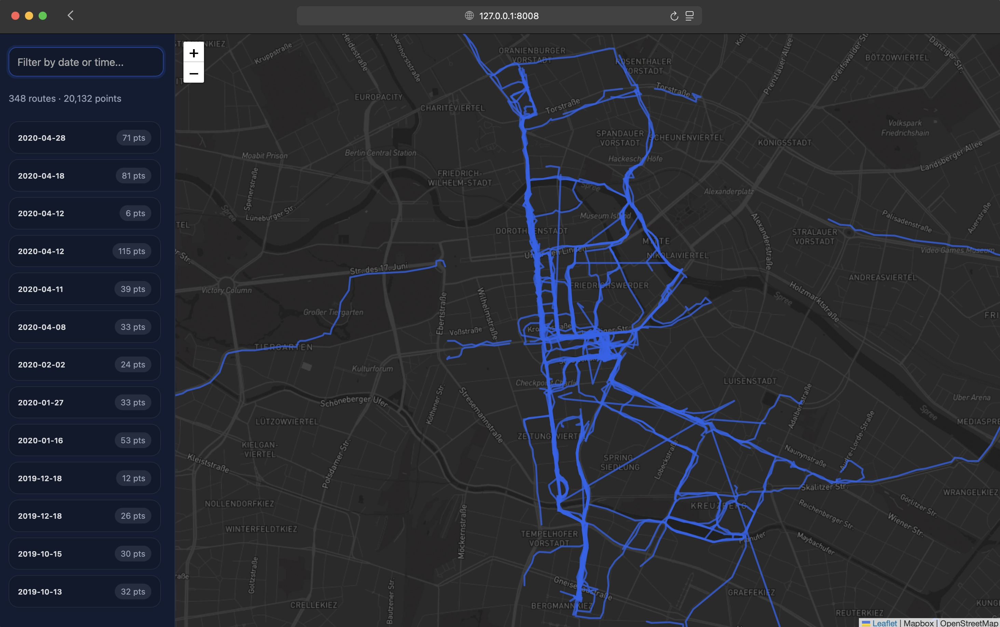

# GPX Walk Explorer

Static, zero-backend viewer for GPX walks exported from Apple Health.

## How to run

1. Export your Apple Health data. After unzipping `export.zip`, you will find a `workout-routes/` directory containing all GPX files.
2. Copy that directory into this project (or point the generator to it with `--source`). The generator defaults to `workout-routes/`, so either rename the folder or pass the flag explicitly.
3. From the project root, build the static assets:

   ```bash
   # example using the default workout-routes directory
   python generate_routes.py

   # or, you can specify the source directory for routes
   python generate_routes.py --source workout-routes
   ```

   The script parses each GPX, simplifies the geometry, and writes:

   - `dist/routes.geojson` &mdash; MultiLineString FeatureCollection for Leaflet
   - `dist/routes_manifest.json` &mdash; metadata (dates, point counts, bounds)

4. Serve the `dist/` folder with any static file server (needed because the viewer fetches JSON). For example:

   ```bash
   python -m http.server --directory dist 8000
   ```

5. Open http://127.0.0.1:8000/ in a browser. The map renders all routes using Mapbox (if a token is set) or falls back to OpenStreetMap tiles.

## Features

- Newest walk selected automatically, highlighted in red.
- Sidebar sorted newest → oldest; each entry shows the ISO date and point count.
- Full-map rendering, no network calls beyond the bundled tiles.
- Search filters by filename or ISO date.

## Mapbox token

`dist/index.html` references a Mapbox token (`MAPBOX_ACCESS_TOKEN`). Replace it with your own if needed. If the constant is left blank, the viewer automatically falls back to OpenStreetMap tiles.

## Regenerating

Re-run `python generate_routes.py` whenever you add/remove GPX files. The script reports skipped files (e.g., malformed GPX or missing coordinates).
